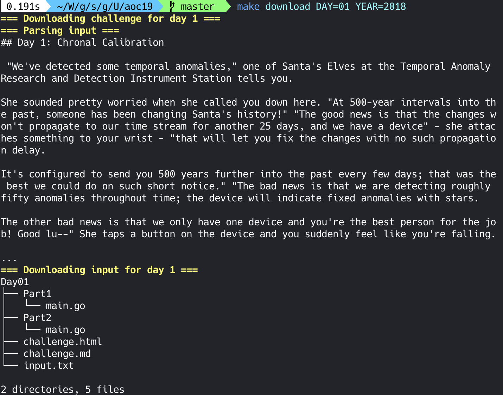
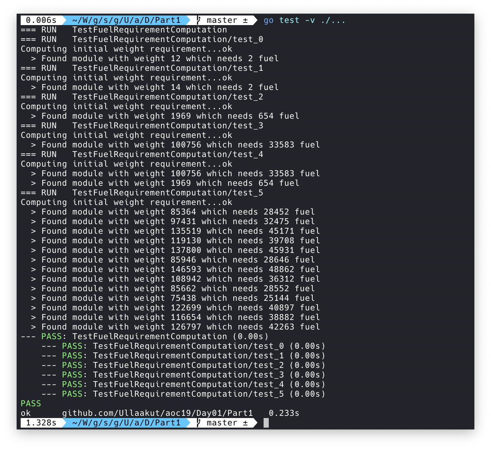

# Advent of Code 2019

This repository contains my solutions for the advent of code puzzles of year 2019. If you're looking for 2018, [here it is](https://github.com/Ullaakut/aoc18).

The improvement over last year is that this year, I'm adding a handy **Makefile** which does the following:

* **Automatically downloads** the challenge and input for the day (e.g.: `make download DAY=03`)
    * In order to use this target, you need to specify your session cookie from `adventofcode.com` in `AOC_COOKIE`.
    * Parses the challenge into a markdown file (adds Markdown style headers and code blocks).
    * This part still needs a bit of work, as multiline code blocks are not supported yet, and formatting (bold, italics etc.) is lost.
* Automatically **generates a folder structure** to contain a program for each part of each day
* Runs the solutions for each day that was currently implemented (`make run`)
* Runs all unit tests (`make test`)
* Is self-documented (`make help`)

You can reuse this Makefile for other years by specifying the `YEAR` variable in your environment. By default, it is going to use `2019`.

Here is an example of how it looks (the output is normally not cut, but puzzle descriptions are too long to fit on an example screenshot). It takes about one second to download and parse the challenge, download the input, and create the folders and files for solving them. Feel free to change the template to fit your way of solving AOC puzzles, if you want to reuse this repository :)

    

## Recap

Day | Completed | Project | Challenge | Language | Tests
----|--------------|---------|-------|---------|------
01 | :white_check_mark: | [day01](day01) | [Advent of Code 2019 - Day 01](https://adventofcode.com/2019/day/1)  | Go | :white_check_mark:
02 | :white_check_mark: | [day02](day02) | [Advent of Code 2019 - Day 02](https://adventofcode.com/2019/day/2)  | Go | :white_check_mark:
03 | :white_check_mark: | [day03](day03) | [Advent of Code 2019 - Day 03](https://adventofcode.com/2019/day/3)  | Go | :white_check_mark:
04 | :white_check_mark: | [day04](day04) | [Advent of Code 2019 - Day 04](https://adventofcode.com/2019/day/4)  | Go | :white_check_mark:
05 | :white_check_mark: | [day05](day05) | [Advent of Code 2019 - Day 05](https://adventofcode.com/2019/day/5)  | Go | :white_check_mark:
06 | :soon: | [day06](day06) | [Advent of Code 2019 - Day 06](https://adventofcode.com/2019/day/6)  | Go | :soon:
07 | :soon: | [day07](day07) | [Advent of Code 2019 - Day 07](https://adventofcode.com/2019/day/7)  | Go | :soon:
08 | :soon: | [day08](day08) | [Advent of Code 2019 - Day 08](https://adventofcode.com/2019/day/8)  | Go | :soon:
09 | :soon: | [day09](day09) | [Advent of Code 2019 - Day 09](https://adventofcode.com/2019/day/9)  | Go | :soon:
10 | :soon: | [day10](day10) | [Advent of Code 2019 - Day 10](https://adventofcode.com/2019/day/10) | Go | :soon:
11 | :soon: | [day11](day11) | [Advent of Code 2019 - Day 11](https://adventofcode.com/2019/day/11) | Go | :soon:
12 | :soon: | [day12](day12) | [Advent of Code 2019 - Day 12](https://adventofcode.com/2019/day/12) | Go | :soon:
13 | :soon: | [day13](day13) | [Advent of Code 2019 - Day 13](https://adventofcode.com/2019/day/13) | Go | :soon:
14 | :soon: | [day14](day14) | [Advent of Code 2019 - Day 14](https://adventofcode.com/2019/day/14) | Go | :soon:
15 | :soon: | [day15](day15) | [Advent of Code 2019 - Day 15](https://adventofcode.com/2019/day/15) | Go | :soon:
16 | :soon: | [day16](day16) | [Advent of Code 2019 - Day 16](https://adventofcode.com/2019/day/16) | Go | :soon:
17 | :soon: | [day17](day17) | [Advent of Code 2019 - Day 17](https://adventofcode.com/2019/day/17) | Go | :soon:
18 | :soon: | [day18](day18) | [Advent of Code 2019 - Day 18](https://adventofcode.com/2019/day/18) | Go | :soon:
19 | :soon: | [day19](day19) | [Advent of Code 2019 - Day 19](https://adventofcode.com/2019/day/19) | Go | :soon:
20 | :soon: | [day20](day20) | [Advent of Code 2019 - Day 20](https://adventofcode.com/2019/day/20) | Go | :soon:
21 | :soon: | [day21](day21) | [Advent of Code 2019 - Day 21](https://adventofcode.com/2019/day/21) | Go | :soon:
22 | :soon: | [day22](day22) | [Advent of Code 2019 - Day 22](https://adventofcode.com/2019/day/22) | Go | :soon:
23 | :soon: | [day23](day23) | [Advent of Code 2019 - Day 23](https://adventofcode.com/2019/day/23) | Go | :soon:
24 | :soon: | [day24](day24) | [Advent of Code 2019 - Day 24](https://adventofcode.com/2019/day/24) | Go | :soon:
25 | :soon: | [day25](day25) | [Advent of Code 2019 - Day 25](https://adventofcode.com/2019/day/25) | Go | :soon:

## Day 1

### Part 1

    
    

### Part 2

    
    

## Day 2

### Part 1

    
    

### Part 2

    
    

## Day 3

### Part 1

    
    

### Part 2

    
    

## Day 4

### Part 1

    
    

### Part 2

    
    

## Day 5

### Part 1

    
    

### Part 2

    
    

